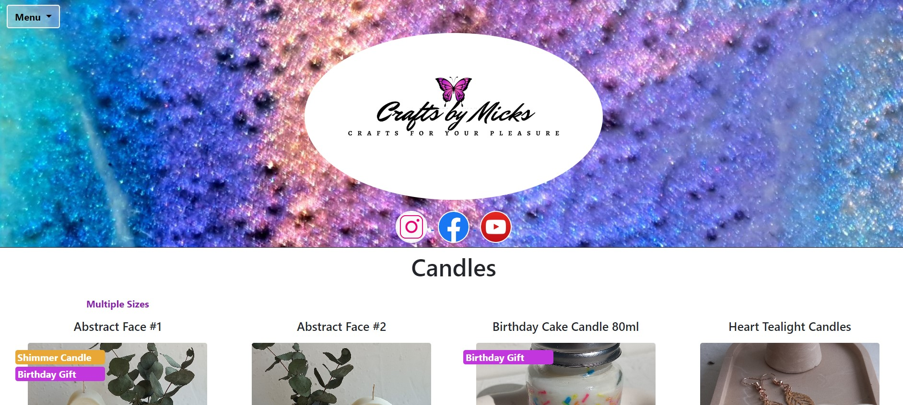
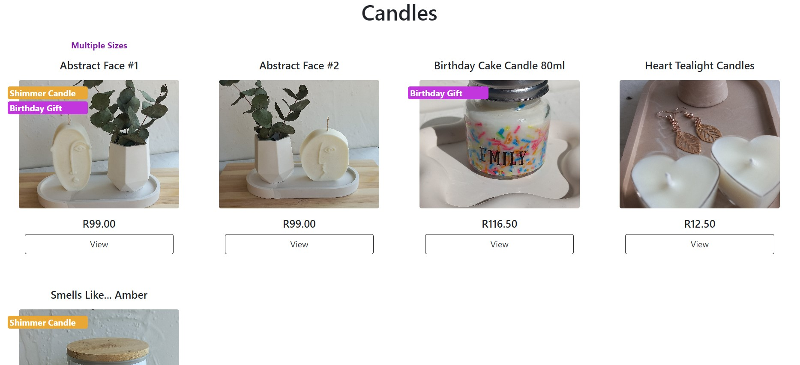
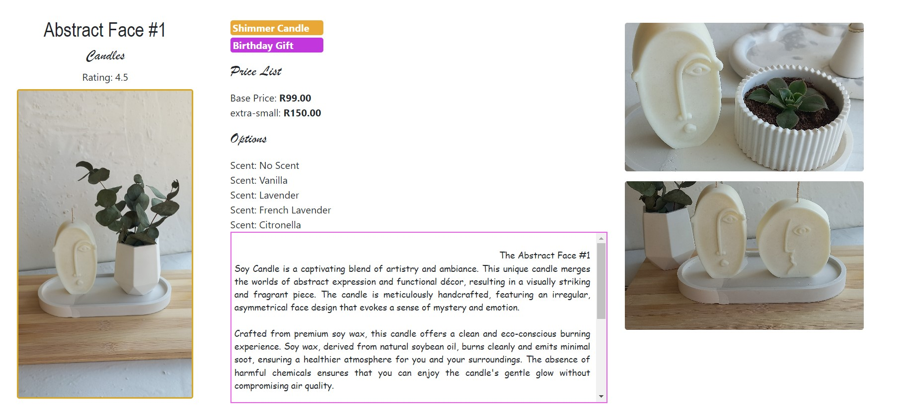
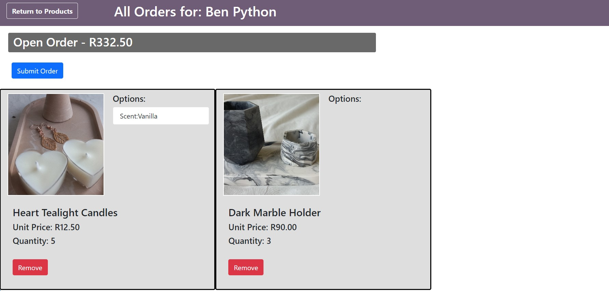
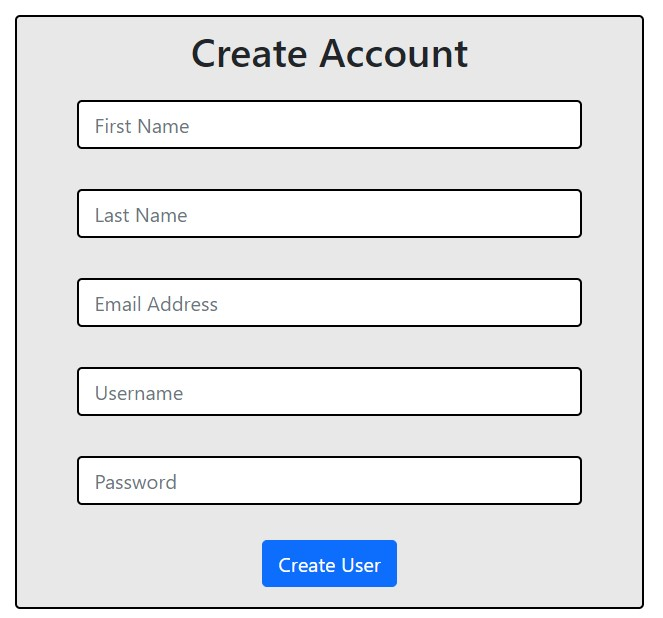
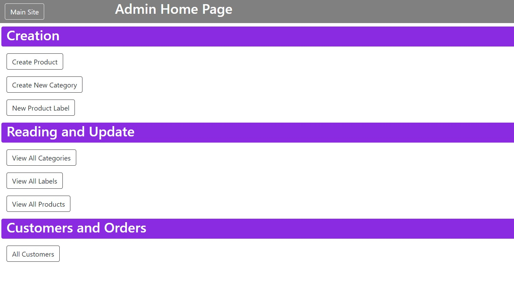
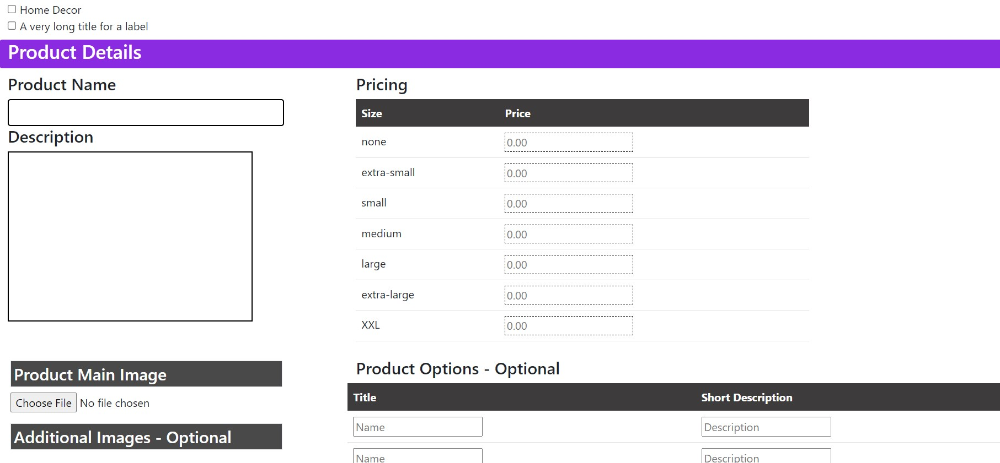
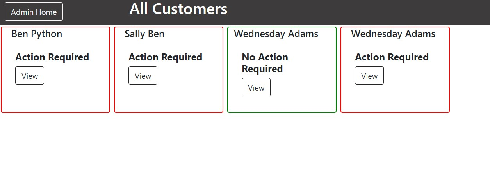

# Django Capstone Project - E Commerce Website
# Kyle de Vos - HyperionDev Student

### Contents
- [Description](#description)
- [Features](#features)
- [Software and Hardware](#software-and-hardware)
- [Opening and Running of Project](#opening-and-running-of-project)
- [Visuals](#visuals)
- [Program Execution Summary](#program-execution)
- [Future Development and Improvement](#future-development-and-improvement)

# Description
The aim of this project was to create the foundation structure for an E Commerce Website to be <br>
used by a smaller 'Crafts' Business - Crafts By Micks. The project was designed and created to <br>
have three major components:

1. An Admin Control Part allowing for Product Creation, Ordering Monitoring, etc
2. A Product Website to display Products to clients allowing for order placement and tracking
3. A User Management Part allowing admin, staff and customers to sign up and login to this website


# Features
- Admin Control App
    - Allow Admin (Owner) to create and update Products
    - Allow Admin (Owner) to monitor and Update Orders

- User Management
    - Current Implementation allows customers to sign up to the website (saving their details)
    - Customer Login and Logout
    - Saved User's can create and place Product Orders

- Complete Product Display Website
- Order Creation and Placement
- Product Review Functionality
- SQLite Database

# Software and Hardware

### Hardware
This project was developed on a Lenovo Ideapad 3 i5 Laptop running Windows 11 <br>
11th Gen Intel(R) Core(TM) i5-1135G7 @ 2.40GHz - 2.42 GHz<br>
Display Resolution 1920 x 1080

### Software
This project was developed, tested and tracked using:
- Microsoft Visual Studio Code with sqlite3
- Google Chrome Version 117.0.5938.92
- Git and GitHub
- BootStrap

# Opening and Running of Project

## Using a Virtual Environment

Successful run of Project requires 'Pillow' and 'Popper' Libraries seen in 'requirements.txt'<br>
Project does not include virtual environment and will need to be loaded within one. Commands below<br>
are needed to start project

1. To create a virtual Environment, run the command below in a terminal window within the current directory
```
python -m venv [name]
```

2. Move into the virtual environment and activate
```
cd [name]
Scripts\activate
```

3. Install Django and Pillow Libraries (will require 'pip' to be installed first)
```
pip install django
pip install pillow
```

4. Clone project repo within virtual enviroment using 'git clone'


5. Move into django project:

```
cd django_capstone
```

6. Start Server:
```
python manage.py runserver
```

7. Default port to view website would be given as: http://127.0.0.1:8000/

8. If successful, project Main Product Site Home Page will open (See Fig 1. Below)

## Using Dockerfile and viewing on Docker Playground

A docker file has been included for dependency installion using the requirements.txt file.<br>
'Docker Desktop' will need to be downloaded on the PC. Project will need to be pushed<br>
to 'DockerHub' requiring an account to be created. Project will finally be run on<br>
'Docker Playground'. 'DockerHub' and 'Docker Playground' need to be accessed with a<br>
web browser.

Ensuring you are in the same directory as the 'Dockerfile' and that Docker Desktop<br>
is running, run the following commands:

1. Build the Docker Image using:
```
docker build -t [name of project] ./
```

If successful, the image can be seen on 'Docker Desktop' under the 'Images' Tag

2. Run the image locally using:
```
docker run -d -p 80:80 [name of project]
```

To push the project to Docker Hub and run on Docker Playground:

3. Tag the project:
```
docker tag [name of project] [docker username]/[name of project]
```

4. Perform login
```
docker login
```

5. Push the Image to Docker Hub:
```
docker push [docker username]/[name of project]
```

Once completed, check the image is on your Docker Hub under 'Repositories'

6. Open Docker Playground and select 'Start'. Select 'Add New Instance'.<br>

In the terminal window that opens, enter the following command:
```
docker run -p 80:8000 [docker username]/[name of project]
```

7. Once running, check if an '80' button has been created next to 'Open Port'.<br>
If so, click this button to be taken to the app home page.<br>
If not, click the 'Open Port' button and enter '80'

NOTE: After completion, remember to stop running your docker container if you were running it locally.<br>
In a command terminal on your PC, in the same directory as the 'DockerFile' run:
```
docker ps
```

Note the 'Container ID'. Take note of the first three characters and then enter:
```
docker stop [first three characters]
```

to stop the container running

# Visuals

## Product Site
<h4>Fig 1. Product Site Home</h4>
<p>

<h4>Fig 2. Product Site - Products View</h4>
<p>

<h4>Fig 3. Product Site - Sample Product Details</h4>
<p>

<h4>Fig 4. Product Site - Client Open Order View</h4>
<p>

## User Management

<h4>Fig 5. User Management - SignUp</h4>
<p>

## Admin Control

<h4>Fig 6. Admin Control Home Page</h4>
<p>

<h4>Fig 7. Admin Control Create Product</h4>
<p>

<h4>Fig 8. Admin Control Client Orders</h4>
<p>

# Program Execution

### Customers
This project makes use of the MVT Architecture provided by Django connecting and controlling<br>
models and templates through the Views files for each App.

The program's first run (by starting the server) will launch the 'project_site' app's homepage<br>
with a dropdown 'Menu' on the top-left of the screen (See Fig 1.) to access the User Sign-Up and<br>
Login functionality provided by the 'user_management' app. This dropdown menu will also give access<br>
to the 'Logout' functionality. Products can be viewed and selected from the 'project_site' homepage<br>
(See Fig 2. and Fig 3.)

A logged-in customer can access their 'Order' tab from the same dropdown menu which is only visible to a<br>
logged-in customer. (See Fig 4. )

### Admin-User (Owner)
Only a user signed in with 'staff' status can access the 'Admin Control' Functionality (in the dropdown menu)<br>
provided by the django app 'crafts_by_micks' (See Fig 6.) This allows the user to create categories, labels<br>
and products including 'update' and limited 'deletion' functionality. The Admin User can also access client order<br>
data (See Fig 8.) allowing for order status modifications as customer order moves from 'received' state<br>
to 'completed' state

# Future Development and Improvement

### Functionality

This project has incompleted functionality up for completion in the next version. This includes:
1. Display of written reviews for a product. Current Implementation only calculates the review<br>
rating for a product
2. Calculation and automatic update of 'Label' deletions using date of creation and 'days till<br>
removal' field for 'Label' model

Admin User deletion of Products capability was removed from this project. Deletion of Product Data<br>
has cascading effects to customer Orders and would affect the accuracy of their order data. It was<br>
decided that data deletion (extending to user data deletion) was not to be implemented in this version.<br>
Combinations of Data Accuracy and User Data Safety and Privacy need to be discussed and reviewed in detail<br>
before project implementation.

### Online Capability

Future development would expand capability for project use of servers allowing for online functionality<br>
of this django project site. 

### Data Safety and Security

Future Development would put a strong focus on the encryption and secure storage of all user data <br>
inclusive of personal and order data. 

### Design

The current front-end design of the website would seek guidance from expert web designers allowing for<br>
improvements in design style, efficiency and capability of site to be appealing to customers. Back-end<br>
data storage and manipulation needs to be reviewed for inefficiencies resulting in greater use of<br>
memory and slower performance of site.
